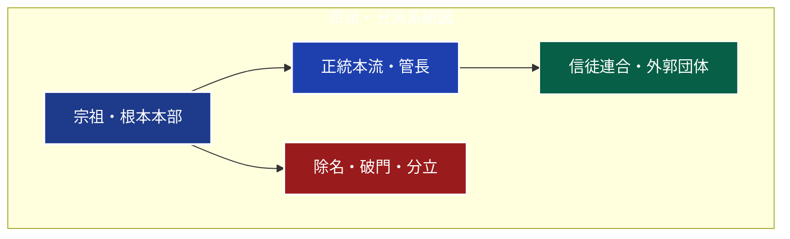

# Mermaid Hygiene & Contrast Validation 専門スキルガイド

本スキルは、Obsidian Vault および Quartz 公開環境における **Mermaid ダイアグラムの構文エラー防止、アクセシビリティ（背景色と文字色の十分なコントラスト比）、およびテーマ互換性（ライト/ダーク両対応）** を担保・自動検証するための専門スキルである。

---

## 🧭 背景と解決する課題

### 1. 視認性・コントラスト問題（背景が濃い色で文字が黒くなる問題）
Quartz等の静的サイトジェネレータでは、グローバルCSS（`text { fill: var(--darkgray); color: var(--darkgray); }`）がSVGテキストに強制適用される場合があります。
Mermaidで濃紺（`#1e3a8a`）や深紅（`#991b1b`）などの暗い背景色を指定した際、文字色に明示的な白（`color:#ffffff` または `color:#fff`）を指定しないと、**ライトモード下で文字が黒に近いグレーで描画され、人間には全く読めなくなる（可読性の破綻）** 現象が発生します。

### 2. Mermaid 11（Quartz採用版）レキサー制約
Mermaid 11 では、`subgraph` の識別子（ID）に中黒（`・`）やスラッシュ（`/`）、丸括弧（`（`, `(`）などの記号が含まれていると、パーサーが字句解析（Lexical analysis）の段階でクラッシュし、**ページ全体のMermaid描画が真っ白・エラーブロック化**します。

---

## 🛡️ 8大構文・視認性バリデーションルール

本スキルでは、以下の8つのルールを厳格に検査します：

| ルールID | 種別 | 判定内容 | 修正・対応方針 |
| :--- | :--- | :--- | :--- |
| **Rule 1: BLOCK_MISMATCH** | 構文 | Mermaidコードブロックの終了バッククォート（` ``` `）の欠落 | ブロックを必ず ` ``` ` で閉じる |
| **Rule 2: SUBGRAPH_MISMATCH** | 構文 | `subgraph` の開始数と `end` の対応数が不一致 | すべての `subgraph` に対応する `end` を配置する |
| **Rule 3: QUOTE_COLLISION** | 構文 | HTMLタグ付きラベル内でのシングルクォート混入（例: `L'Oreal`） | アポストロフィ `’` または和名表記に置換する |
| **Rule 4: INVALID_ARROW** | 構文 | 不正な矢印演算子（例: `-->>`, `-->-->` 等） | 標準の `-->` または `-.->`, `==>` を使用する |
| **Rule 5: UNQUOTED_EDGE_LABEL** | 構文 | 双方向リンクの未クォートラベル（例: `<-->\|label\|`） | 必ずダブルクォートで囲む（例: `<--> \|"label"\|`） |
| **Rule 6: HAZARDOUS_SUBGRAPH_ID** | 構文 | `subgraph` ID に中黒（`・`）やスラッシュ、括弧などの記号を含む | IDから記号を除去し、表示名は `subgraph ID["表示名"]` で指定する |
| **Rule 7: DARK_FILL_WITHOUT_WHITE_TEXT** | 視認性 | 暗色背景（YIQ輝度 < 130）のノードに白文字（`color:#fff`）が未指定 | `classDef` または `style` に必ず `color:#ffffff` を追加する |
| **Rule 8: MERMAID_COMMENT_HAZARD** | 互換性 | コードブロック内に `%%` コメントが存在（Quartz OFMが削除し破損） | コメント行を削除するか、コードブロック外の注記にする |

---

## 🎨 推奨カラーパレット＆クラス定義標準

ダイアグラムを作成・編集する際は、以下の高コントラスト標準カラーパレットを使用すること：



### 💡 設計原則
1. **暗色背景ノードには必ず `color:#ffffff;` または `color:#fff;` をセットにする**。
2. **`subgraph` に中黒や記号を使わない**:
   - ❌ 悪い例: `subgraph 門祖・開山期["【門流草創】"]`
   - ⭕ 良い例: `subgraph 門祖開山期["【門流草創】"]`
3. **双方向リンクのラベルは必ず引用符で囲む**:
   - ❌ 悪い例: `A <-->|対立抗争| B`
   - ⭕ 良い例: `A <--> |"対立抗争"| B`

---

## 🛠️ 検証ツールの実行方法

本スキルのスクリプトを用いて、Markdownファイル単体またはディレクトリ全体のダイアグラムを即座に検証できます。

### 1. 単体ファイル検証
```powershell
python "C:\Users\iidam\claude-gemini-skills\mermaid-hygiene\scripts\validate_mermaid.py" "D:\Vault\religion\01_宗派・異端研究\05_法華・日蓮系\日蓮正宗.md"
```

### 2. Vault全体の全件検証
```powershell
python "C:\Users\iidam\claude-gemini-skills\mermaid-hygiene\scripts\validate_mermaid.py" "D:\Vault\religion"
```

### 3. Quartz公開ディレクトリの検証
```powershell
python "C:\Users\iidam\claude-gemini-skills\mermaid-hygiene\scripts\validate_mermaid.py" "C:\Users\iidam\quartz-religion\content"
```
